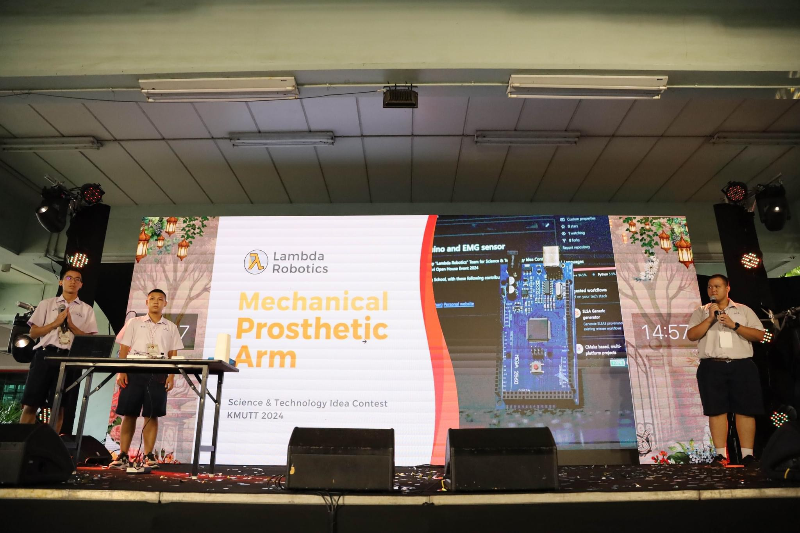
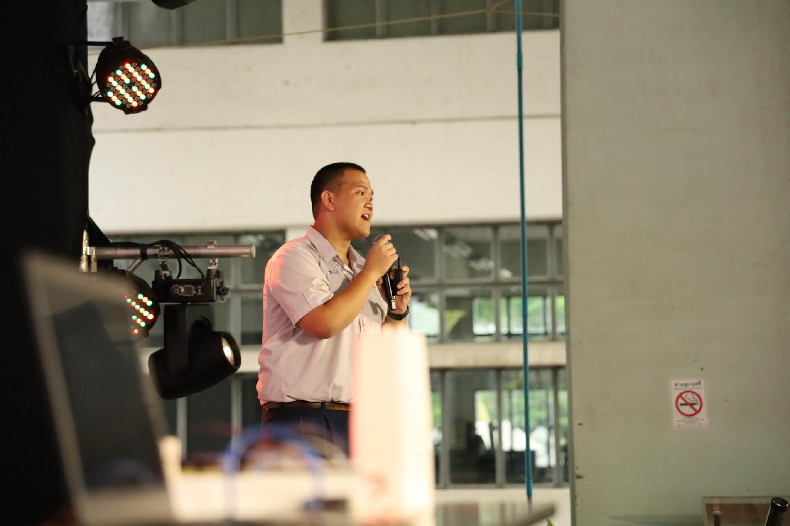
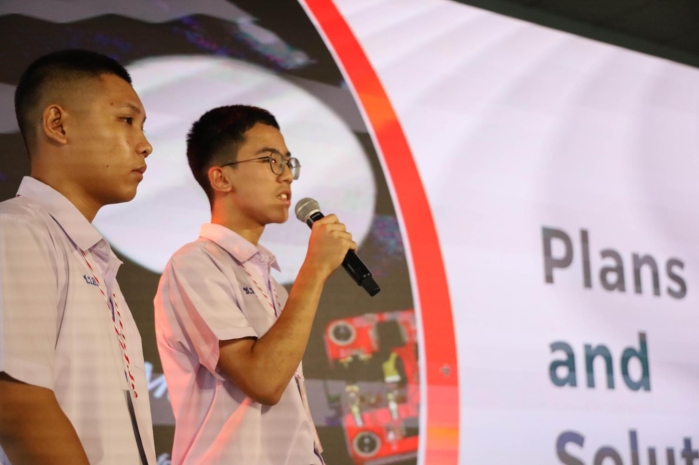
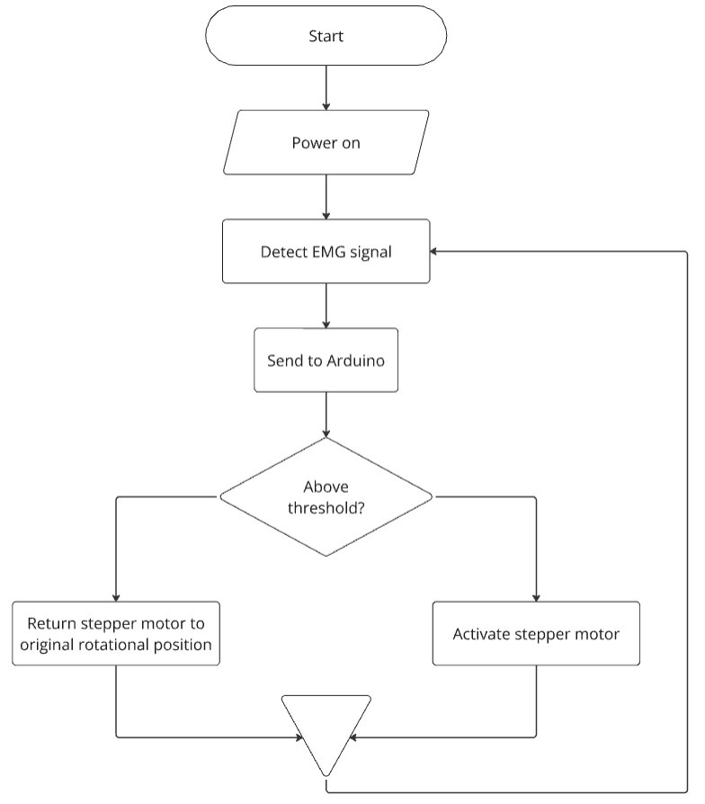

# Prosthetic Arm with Arduino and EMG sensor

This project is made, contributed, and maintained by "Lambda Robotics" Team for Science & Technology Idea Contest of King Mongkut's University of Technology Thonburi Open House Event 2024

## Photos from King Mongkut's University of Technology Open House Event 2024

## The flowchart summarizing the operation of prosthetic arm

## The project needed these minimum equipments
- Arduino Mega
- CNC Shield v3
- Stepper motor
- Power Supply
- AD8832 and EMG electrodes
- 3D printed models from "assets" directory
- Bearings
- Potentiometer (For demonstration purposes, read below)

## NOTE : The "demo" directory was made for demonstration, using potentiometer for switching between the act of closing and opening of palm, with only one stepper working.

All the contributers are from Chonradsadornumrung School, with these following contributers
- Gristapak Wiwattana [Github (Gristapak)](https://github.com/Gristapak)
- Sila Chailek [Github (VoidDwellor)](https://github.com/VoidDwellor)
- Supakorn Huemwamg (Han Senni) [Github (senni-han)](https://github.com/senni-han) [Personal website](https://senni-han.github.io)
